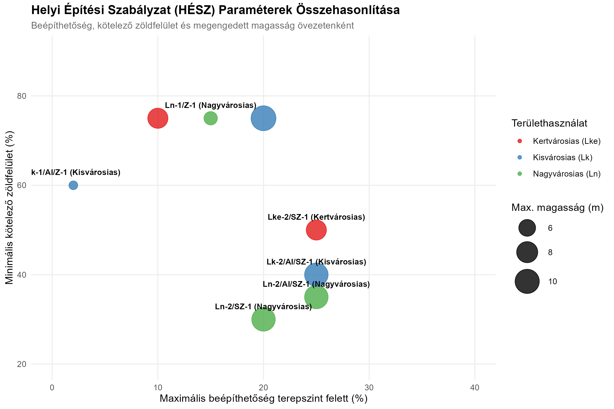

Markdown

# Municipal Zoning Code Analysis (HÉSZ) with R

This repository contains an R workflow designed to parse, structure, and visualize local municipal zoning and building regulations (Helyi Építési Szabályzat - HÉSZ) from raw regulatory documents into analytical models.

## 📊 Project Overview
In urban planning and municipal administration, regulatory frameworks dictate the physical boundaries of development. 

This project takes the complex, tabular data of a local Hungarian municipal development plan (containing zoning codes, maximum buildable area ratios, mandatory green space percentages, and building height limits) and converts them into a structured data frame using `tidyverse`.

### Key Visualization: The Zoning Regulation Matrix
The generated plot visualizes the regulatory "trade-offs" and limits across three major zoning categories: **High-density Urban (Ln)**, **Medium-density Town (Lk)**, and **Low-density Suburban (Lke)**.

* **X-Axis:** Maximum allowable above-ground buildable area (%).
* **Y-Axis:** Minimum mandatory green space (%).
* **Point Size:** Maximum permitted building height (meters).

---

## 🧠 Policy and Regulatory Insights (The Cross-Section)

As a Policy Analyst with a BA (Hons) in Social Science (UWS) and experience in independent regulatory monitoring (IMB - Ministry of Justice), this project bridges the gap between public administration, local government policy, and data science:

1. **Regulatory Auditing & Transparency:** Just as in independent monitoring operations, public transparency is vital. This tool translates dry, complex legal regulations into a clear, visual matrix, making municipal rules accessible to citizens, real estate developers, and environmental auditors alike.
2. **Environmental & Green Policy:** In the era of climate change and the "Urban Heat Island" effect, tracking the relationship between maximum buildable area and mandatory green space is critical. The plot clearly shows the *diagonal trade-off line*: as buildability increases, green space is systematically reduced.
3. **Identifying Anomalies (Outliers):** The analysis successfully flags regulation anomalies. For example, the `Lk-1/AI/Z-1 (Kisvárosias)` zone is classified as "town density," yet features a strict **2% buildability limit**. This occurs because the `AI` designation represents protected institutional green areas (e.g., schoolyards or clinic parks) within the zoning code—proving that the analytical model can automatically detect specialized administrative protections.

---

## 🛠️ Tech Stack & Methods
* **Language:** R
* **Core Libraries:** `tidyverse` (ggplot2, dplyr, tibble)
* **Visualizations:** Multidimensional scatter plot mapping three distinct regulatory variables simultaneously (X/Y coordinates, color, and size).
